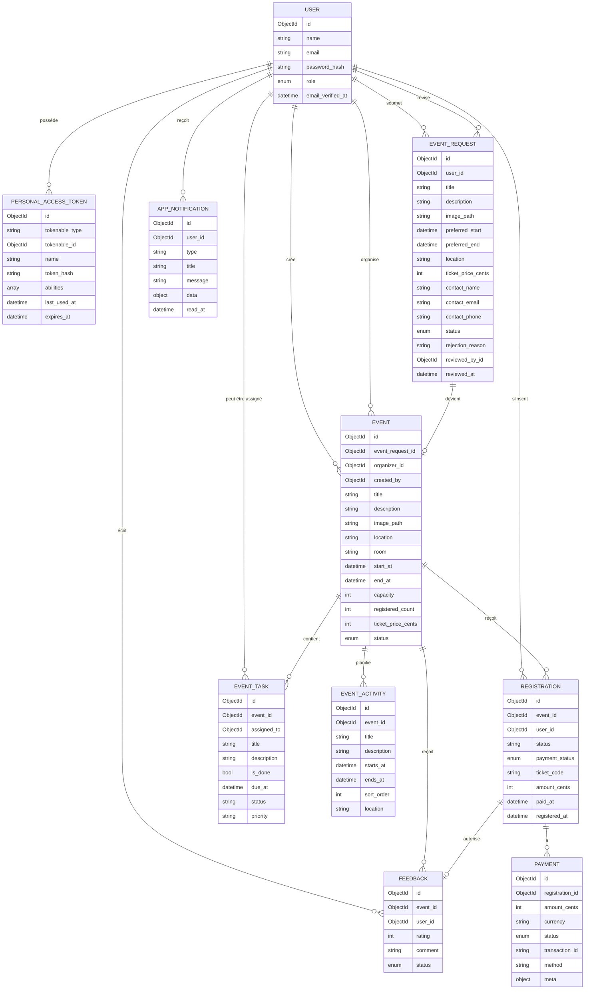

# Documentation Merise

Ce document décrit le backend avec des vues de style Merise :

- MCD : modèle conceptuel de données, axé sur les entités et les relations métier.
- MLD : modèle logique de données, axé sur les collections Mongo, les champs et les index.
- MCT : modèle conceptuel de traitement, axé sur les événements, les opérations, les règles et les résultats.

L'implémentation est exclusivement MongoDB, donc le MLD utilise des collections au lieu de tables SQL. Les champs de relation sont stockés sous forme de chaînes Mongo ObjectId dans des champs tels que `event_id`, `user_id` et `registration_id`.

## MCD - Modèle Conceptuel de Données

## Cardinalités du MCD

| Association | Cardinalité | Signification |
| --- | --- | --- |
| Utilisateur - PersonalAccessToken | un utilisateur pour zéro ou plusieurs jetons | Un utilisateur peut avoir plusieurs jetons d'API. Un jeton appartient à un utilisateur. |
| Utilisateur - EventRequest | un client pour zéro ou plusieurs demandes | Un client peut soumettre des demandes. Une demande a un client émetteur. |
| Utilisateur - Révision EventRequest | un administrateur pour zéro ou plusieurs demandes révisées | Une demande révisée peut référencer l'administrateur qui l'a révisée. |
| EventRequest - Event | une demande pour zéro ou un événement | L'approbation crée un projet d'événement. Le rejet ne crée aucun événement. |
| Utilisateur - Créateur Event | un utilisateur pour zéro ou plusieurs événements créés | Un administrateur ou un organisateur peut créer des événements. |
| Utilisateur - Organisateur Event | un organisateur ou administrateur pour zéro ou plusieurs événements assignés | Un événement peut être assigné à un organisateur, et le service accepte aussi un administrateur comme responsable interne. |
| Événement - EventTask | un événement pour zéro ou plusieurs tâches | Les tâches appartiennent à un seul événement. |
| Événement - EventActivity | un événement pour zéro ou plusieurs activités | Les activités appartiennent à une seule chronologie d'événement. |
| Événement - Registration | un événement pour zéro ou plusieurs inscriptions | Les inscriptions comptent pour la capacité de l'événement. |
| Utilisateur - Registration | un participant pour zéro ou plusieurs inscriptions | Un participant peut s'inscrire une seule fois par événement. |
| Inscription - Payment | une inscription pour zéro ou plusieurs paiements | Les événements gratuits créent un paiement gratuit complété ; les événements payants créent un paiement lors du règlement. |
| Événement - Feedback | un événement pour zéro ou plusieurs commentaires | Les commentaires sont attachés à un événement. |
| Utilisateur - Feedback | un participant pour zéro ou plusieurs commentaires | Un participant peut laisser un seul commentaire par événement. |
| Inscription - Feedback | une inscription payée permet zéro ou un commentaire | Les commentaires ne sont acceptés que de la part des participants ayant une inscription payée. |
| Utilisateur - AppNotification | un utilisateur pour zéro ou plusieurs notifications | Les notifications sont stockées par destinataire. |

## MLD - Collections Mongo Logiques

### `users`

Objectif : identité d'authentification et propriété des rôles.

Champs :

- `_id` : Mongo ObjectId.
- `name` : nom d'affichage de l'utilisateur.
- `email` : email de connexion unique.
- `password` : mot de passe haché.
- `role` : l'un de `admin`, `organizer`, `participant`, `client`.
- `email_verified_at`, `remember_token`, `created_at`, `updated_at`.

Index :

- `users_email_unique` : recherche d'email unique pour la connexion et la prévention des doublons.
- `users_role_idx` : filtrage par rôle pour la gestion des utilisateurs par l'administrateur.

### `personal_access_tokens`

Objectif : jetons porteurs (bearer tokens) Sanctum stockés dans MongoDB.

Champs :

- `_id` : Mongo ObjectId.
- `tokenable_type`, `tokenable_id` : propriétaire du jeton.
- `name` : étiquette du jeton, actuellement `spa`.
- `token` : valeur du jeton hachée.
- `abilities` : capacités du jeton.
- `last_used_at`, `expires_at`, `created_at`, `updated_at`.

Index :

- `tokens_token_unique` : recherche de jeton.
- `tokens_tokenable_idx` : recherche du propriétaire du jeton.
- `tokens_expires_at_idx` : support pour le nettoyage des jetons expirés.

### `event_requests`

Objectif : propositions de clients avant qu'elles ne deviennent des événements gérés.

Champs :

- `_id`.
- `user_id` : client.
- `title`, `description`, `image_path`, `location`.
- `preferred_start`, `preferred_end`.
- `ticket_price_cents`.
- `contact_name`, `contact_email`, `contact_phone`.
- `status` : `pending`, `approved`, `rejected`.
- `rejection_reason`.
- `reviewed_by_id`, `reviewed_at`.
- horodatages.

Index :

- `event_requests_contact_status_idx` : recherche de demande client par contact/statut.
- `event_requests_status_created_idx` : liste de modération administrateur.

### `events`

Objectif : événements concrets gérés par les organisateurs et les administrateurs.

Champs :

- `_id`.
- `event_request_id` : demande source (nullable).
- `organizer_id` : organisateur ou administrateur assigné (nullable).
- `created_by` : utilisateur ayant créé l'événement.
- `title`, `description`, `image_path`, `location`, `room`.
- `start_at`, `end_at`.
- `capacity`, `registered_count`.
- `ticket_price_cents`.
- `status` : `draft`, `pending_publication`, `published`, `cancelled`, `completed`.
- horodatages.

Index :

- `events_event_request_unique` : un événement par demande approuvée.
- `events_status_start_idx` : navigation publique et vérifications d'événements actifs.
- `events_organizer_status_idx` : tableaux de bord des organisateurs.
- `events_creator_status_idx` : tableaux de bord "créés par moi" des administrateurs/organisateurs.

### `event_tasks`

Objectif : tâches de préparation internes pour les événements gérés.

Champs :

- `_id`.
- `event_id`.
- `assigned_to` : assignation optionnelle à un utilisateur.
- `title`, `description`.
- `is_done`, `due_at`.
- `status`, `priority`.
- horodatages.

Index :

- `event_tasks_event_due_idx` : listes de tâches d'événements ordonnées par date d'échéance.

### `event_activities`

Objectif : éléments de la chronologie de l'événement publics ou internes.

Champs :

- `_id`.
- `event_id`.
- `title`, `description`.
- `starts_at`, `ends_at`.
- `sort_order`, `location`.
- horodatages.

Index :

- `event_activities_event_order_idx` : ordonnancement du programme de l'événement.

### `registrations`

Objectif : réservation des participants et état des tickets.

Champs :

- `_id`.
- `event_id`.
- `user_id`.
- `ticket_type`.
- `status` : actuellement `registered`.
- `payment_status` : `pending` ou `paid`.
- `ticket_code` : identifiant unique du ticket.
- `amount_cents`.
- `paid_at`, `registered_at`.
- horodatages.

Index :

- `registrations_event_user_unique` : empêche les inscriptions en double à un événement.
- `registrations_user_payment_idx` : filtrage de l'historique des participants.
- `registrations_event_payment_idx` : gestion des inscriptions aux événements.
- `registrations_ticket_code_unique` : unicité du ticket.

### `payments`

Objectif : registre des paiements pour les inscriptions.

Champs :

- `_id`.
- `registration_id`.
- `amount_cents`.
- `currency`.
- `status` : `completed` pour les flux actuels simulés/gratuits.
- `transaction_id`.
- `method` : `free` ou `card_mock`.
- `meta`.
- horodatages.

Index :

- `payments_registration_idx` : recherche par inscription.
- `payments_status_idx` : requêtes de revenus/statistiques.

### `feedbacks`

Objectif : commentaires modérés des participants.

Champs :

- `_id`.
- `event_id`.
- `user_id`.
- `rating`.
- `comment`.
- `status` : `pending` ou `approved`.
- horodatages.

Index :

- `feedbacks_event_user_unique` : un commentaire par utilisateur et par événement.
- `feedbacks_event_status_idx` : listes de commentaires publics approuvés.

### `app_notifications`

Objectif : boîte de réception des notifications dans l'application.

Champs :

- `_id`.
- `user_id`.
- `type`.
- `title`.
- `message`.
- `data`.
- `read_at`.
- horodatages.

Index :

- `notifications_user_read_created_idx` : décomptes des messages non lus et listes de notifications.

## MCT - Modèle Conceptuel de Traitement

### Auth et Identité

| Événement Externe | Opération | Règles Métier | Résultat |
| --- | --- | --- | --- |
| L'utilisateur soumet le formulaire d'inscription | Créer un compte | Le rôle doit être `participant` ou `client` ; l'email doit être unique ; le mot de passe est haché | L'utilisateur et le jeton porteur sont créés |
| L'utilisateur soumet le formulaire de connexion | Authentifier | L'email et le mot de passe doivent correspondre à un utilisateur stocké ; la connexion est limitée en débit | Le jeton porteur est créé |
| L'utilisateur demande `/api/user` | Identifier le propriétaire du jeton | Le jeton porteur doit être valide | L'utilisateur actuel est renvoyé |
| L'utilisateur se déconnecte | Révoquer le jeton | La requête doit être authentifiée | Le jeton actuel est supprimé |

### Demande d'Événement Client

| Événement Externe | Opération | Règles Métier | Résultat |
| --- | --- | --- | --- |
| Le client soumet une demande d'événement | Valider et stocker la demande | Le client ne peut pas avoir déjà une demande en attente ou un événement actif ; l'image doit être valide si fournie | Une demande en attente est créée |
| Le client supprime la demande | Supprimer la demande en attente | Le client doit posséder la demande ; les demandes révisées ne peuvent pas être supprimées | La demande et l'image sont supprimées |
| L'admin liste les demandes | Filtrer la file de modération | Le filtre de statut optionnel doit être valide | Les demandes sont renvoyées de la plus récente à la plus ancienne |

### Révision de la Demande d'Événement

| Événement Externe | Opération | Règles Métier | Résultat |
| --- | --- | --- | --- |
| L'admin approuve la demande | Marquer la demande approuvée et créer l'événement | La demande doit être toujours en attente ; l'opération est transactionnelle | La demande devient approuvée et un projet d'événement est créé |
| L'admin rejette la demande | Marquer la demande rejetée | La demande doit être toujours en attente ; un motif de rejet est requis | La demande devient rejetée |

### Gestion d'Événement

| Événement Externe | Opération | Règles Métier | Résultat |
| --- | --- | --- | --- |
| L'organisateur crée l'événement | Créer un projet d'événement | L'organisateur ne peut pas publier directement | Un projet d'événement est créé |
| L'admin crée l'événement | Créer un événement | L'admin peut créer un événement publié | L'événement est créé avec le statut demandé |
| L'organisateur met à jour l'événement | Mettre à jour l'événement géré | L'organisateur doit posséder ou avoir créé l'événement ; l'organisateur ne peut pas publier directement | L'événement est mis à jour |
| L'admin assigne un responsable | Assigner un propriétaire d'événement | L'utilisateur assigné doit être un organisateur ou un administrateur | Le responsable de l'événement change |
| L'organisateur demande la publication | Passer l'événement en attente de publication | L'événement doit être gérable par l'organisateur | L'approbation de l'administrateur devient requise |
| L'admin approuve la publication | Publier l'événement | L'événement doit être au statut `pending_publication` | L'événement devient publié et la diffusion participant est mise en file Redis |
| Le gestionnaire change la capacité | Mettre à jour la capacité | La capacité ne peut pas être inférieure à `registered_count` | La capacité change |

### Planification d'Événement

| Événement Externe | Opération | Règles Métier | Résultat |
| --- | --- | --- | --- |
| Le gestionnaire crée une tâche | Ajouter une tâche de préparation | L'acteur doit gérer l'événement | La tâche est stockée |
| Le gestionnaire met à jour une tâche | Modifier la tâche | La tâche doit appartenir à l'événement de la route | La tâche est mise à jour |
| Le gestionnaire supprime une tâche | Supprimer la tâche | La tâche doit appartenir à l'événement de la route | La tâche est supprimée |
| Le gestionnaire crée une activité | Ajouter un élément au programme | Les dates de début/fin doivent être valides | L'activité est stockée |
| Le gestionnaire met à jour une activité | Modifier l'élément du programme | L'activité doit appartenir à l'événement de la route | L'activité est mise à jour |
| Le gestionnaire supprime une activité | Supprimer l'élément du programme | L'activité doit appartenir à l'événement de la route | L'activité est supprimée |

### Inscription et Paiement

| Événement Externe | Opération | Règles Métier | Résultat |
| --- | --- | --- | --- |
| Le participant s'inscrit | Créer une inscription | L'événement doit être publié ; la capacité doit rester disponible ; le participant ne peut pas s'inscrire en double | L'inscription est créée et le compteur de l'événement augmente |
| L'inscription à un événement gratuit réussit | Créer un paiement gratuit | Le montant est nul ou négatif | L'inscription est immédiatement payée et le paiement gratuit est stocké |
| Le participant paie | Simulation de paiement | L'inscription doit être en attente | L'inscription devient payée et le paiement est stocké |
| Le participant annule | Supprimer sa propre inscription | L'inscription ne doit pas être payée | L'inscription est supprimée et le compteur de l'événement diminue |
| Le participant télécharge son ticket | Construire le contenu du ticket | L'inscription doit être payée et appartenir au participant | Le ticket JSON est renvoyé |
| Le personnel supprime une inscription | Supprimer une inscription non payée | Le personnel doit gérer l'événement ; l'inscription ne doit pas être payée | L'inscription est supprimée et le compteur diminue |

### Commentaires et Notifications

| Événement Externe | Opération | Règles Métier | Résultat |
| --- | --- | --- | --- |
| Le participant soumet un commentaire | Stocker le commentaire en attente | Le participant doit avoir une inscription payée ; un commentaire par événement | Un commentaire en attente est créé |
| L'admin approuve le commentaire | Publier le commentaire | Administrateur uniquement | Le commentaire devient approuvé et des notifications sont envoyées |
| L'admin supprime le commentaire | Supprimer le commentaire | Administrateur uniquement | Le commentaire est supprimé |
| Un flux métier envoie une notification ciblée | Créer les documents `app_notifications` | Les destinataires sont dédupliqués avant l'écriture | Les notifications sont stockées par utilisateur |
| La publication d'un événement déclenche la diffusion participant | Mettre en file `FanOutPublishedEventNotifications` | Le job parcourt les participants avec un curseur et écrit par lots | La requête HTTP ne charge pas tous les participants en mémoire |
| L'utilisateur ouvre les notifications | Lister la boîte de réception | L'utilisateur ne voit que ses propres notifications ; la requête Mongo utilise un `facet` pour la page et le compteur non lu | Les notifications, `unread_count` et `meta` sont renvoyés |
| L'utilisateur marque une notification comme lue | Mettre à jour l'état de lecture | La notification doit appartenir à l'utilisateur | `read_at` est défini |

### Stats

| Événement Externe | Opération | Règles Métier | Résultat |
| --- | --- | --- | --- |
| L'admin ouvre le tableau de bord | Agréger les statistiques globales | Administrateur uniquement ; le payload est mis en cache 60 secondes et invalidé par observer lors des mutations suivies | Les décomptes, revenus, travaux en attente et données d'événements sont renvoyés |
| Le client ouvre les stats | Agréger les statistiques du client | Client uniquement ; seuls les événements possédés/demandés sont inclus | Les groupes de demandes, listes d'événements et revenus sont renvoyés |

### Exploitation et Sécurité Transversales

| Événement Externe | Opération | Règles Métier | Résultat |
| --- | --- | --- | --- |
| Un outil appelle `/api/health` | Vérifier MongoDB et Redis | Le endpoint est public ; en production, les erreurs détaillées sont masquées | Statut `ok` ou `degraded` avec détails non sensibles |
| Une réponse API sort de Laravel | Appliquer les en-têtes de sécurité | Les réponses JSON de succès et d'erreur passent par le middleware API | `X-Content-Type-Options`, `X-Frame-Options`, `Referrer-Policy`, `Permissions-Policy`, `X-Permitted-Cross-Domain-Policies` et `Content-Security-Policy` sont présents |

## Notes Merise pour cette Implémentation Mongo

Le modèle Merise classique suppose souvent une base de données relationnelle. Ce backend conserve l'analyse Merise mais mappe le MLD à des collections Mongo :

- les clés primaires sont des ObjectIds Mongo ;
- les clés étrangères sont des champs de chaîne ObjectId ;
- l'intégrité référentielle est assurée par les services et les tests, et non par des contraintes SQL ;
- l'unicité et la performance des requêtes sont assurées par des index Mongo ;
- des transactions sont utilisées pour les flux de travail où plusieurs documents doivent changer ensemble ;
- Redis est requis pour les files d'attente, le cache, la limitation de débit et les sessions ;
- un worker de queue doit tourner en production pour exécuter les diffusions de notifications mises en file.
