# Documentation des Flux de Travail UML

Ce fichier documente les principaux flux de travail de l'application avec des diagrammes Mermaid de style UML. Il est destiné aux développeurs qui ont besoin de comprendre le comportement avant de lire les fichiers PHP.

Mermaid est utilisé pour que les diagrammes restent versionnables dans Git. La plupart des diagrammes utilisent des diagrammes de séquence ou d'activité car le backend est riche en flux de travail.

## Vue Globale des Cas d'Utilisation

```mermaid
flowchart LR
    Admin["Admin"]
    Organizer["Organisateur"]
    Participant["Participant"]
    Client["Client"]

    Auth(("S'authentifier"))
    Browse(("Parcourir les événements"))
    Notifications(("Gérer les notifications"))
    ClientRequest(("Demander un événement"))
    ReviewRequest(("Réviser une demande d'événement"))
    ManageEvents(("Gérer les événements"))
    PlanEvent(("Gérer les tâches et activités"))
    RegisterEvent(("S'inscrire à un événement"))
    PayTicket(("Payer l'inscription"))
    Ticket(("Télécharger le ticket"))
    Feedback(("Soumettre un commentaire"))
    ModerateFeedback(("Modérer les commentaires"))
    UserAdmin(("Gérer les utilisateurs"))
    Stats(("Voir les stats"))

    Admin --> Auth
    Organizer --> Auth
    Participant --> Auth
    Client --> Auth

    Admin --> Browse
    Organizer --> Browse
    Participant --> Browse
    Client --> Browse

    Admin --> Notifications
    Organizer --> Notifications
    Participant --> Notifications
    Client --> Notifications

    Client --> ClientRequest
    Admin --> ReviewRequest
    Admin --> ManageEvents
    Organizer --> ManageEvents
    Admin --> PlanEvent
    Organizer --> PlanEvent
    Participant --> RegisterEvent
    Participant --> PayTicket
    Participant --> Ticket
    Participant --> Feedback
    Admin --> ModerateFeedback
    Admin --> UserAdmin
    Admin --> Stats
    Client --> Stats
```

## 1. Flux d'Inscription

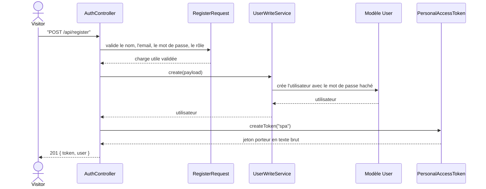

Règles :

- Les utilisateurs publics ne peuvent s'inscrire qu'en tant que `participant` ou `client`.
- Les comptes d'administrateur et d'organisateur sont créés par un administrateur ou par des données de semence (seeds).
- L'index Mongo `users_email_unique` empêche les emails en double.

## 2. Flux de Connexion et d'Authentification par Jeton

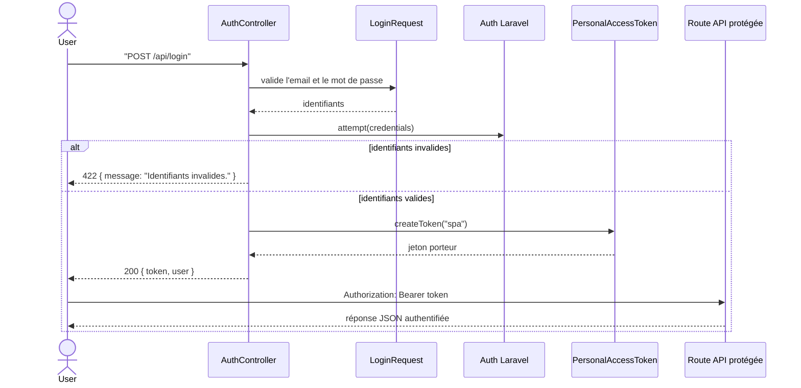

Règles :

- La connexion est limitée en débit (rate limited).
- Les jetons sont stockés dans la collection Mongo `personal_access_tokens`.
- Les consommateurs de l'API doivent envoyer `Authorization: Bearer <token>`.

## 3. Flux de Déconnexion

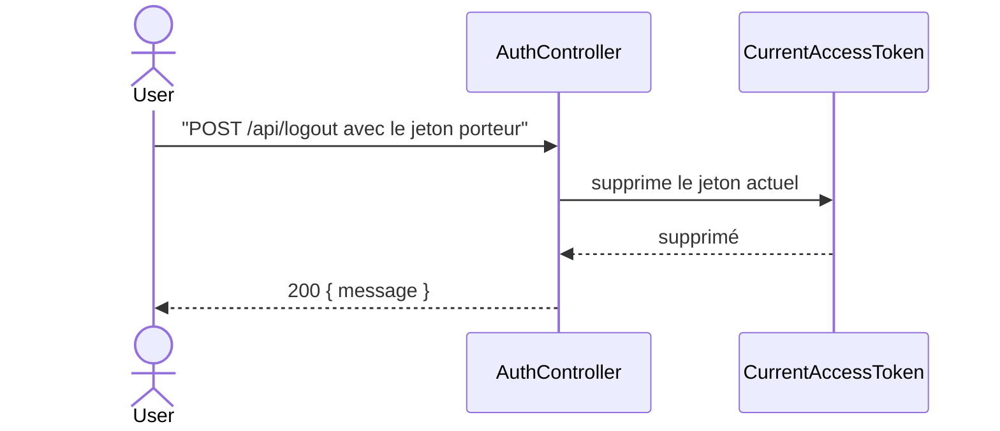

Règles :

- La déconnexion révoque uniquement le jeton utilisé par la requête.
- Les autres jetons pour le même utilisateur ne sont pas révoqués.

## 4. Flux de Notification

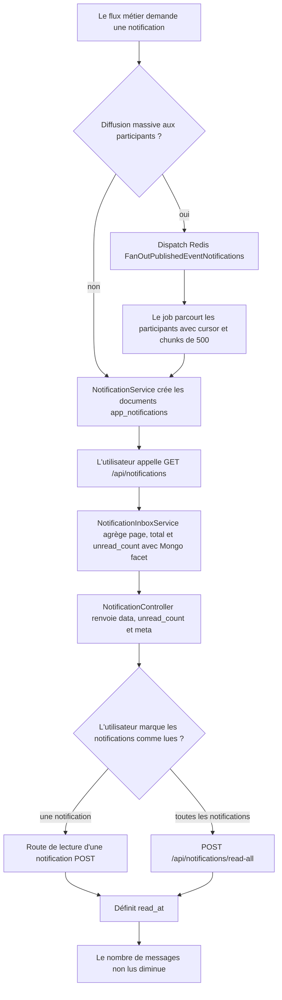

Règles :

- Un utilisateur ne peut lire et mettre à jour que ses propres notifications.
- Les données de notification sont stockées sous forme de métadonnées structurées dans `data`.
- La publication d'un événement ne charge pas tous les participants dans la requête HTTP ; la diffusion passe par la file Redis.
- La liste `/api/notifications` renvoie une page de données, `unread_count` et `meta`.

## 5. Flux de Navigation dans les Événements Publics

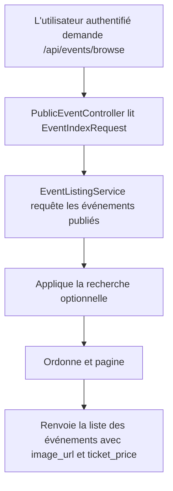

Règles :

- La navigation est authentifiée.
- Seuls les événements publiés sont listés.
- L'argent est exposé sous forme de `ticket_price` ; le stockage reste `ticket_price_cents`.

## 6. Flux de Visibilité du Détail d'un Événement

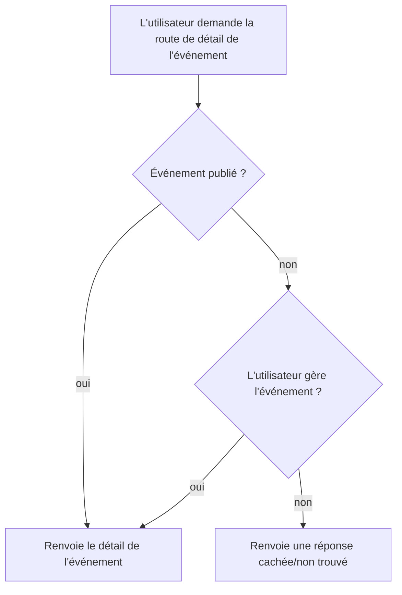

Règles :

- Les événements publiés sont visibles pour les utilisateurs authentifiés.
- Les projets ou événements en attente ne sont visibles que par les administrateurs ou les organisateurs gestionnaires.

## 7. Flux de Création d'un Événement par l'Organisateur

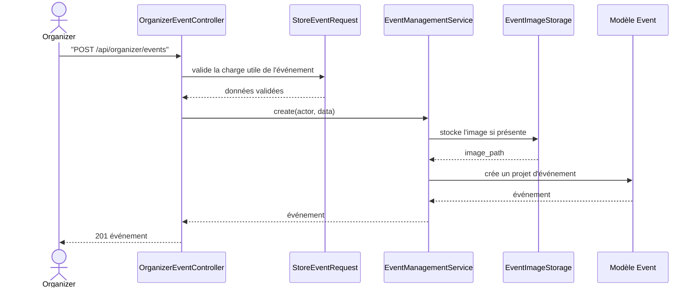

Règles :

- Les événements créés par l'organisateur restent au statut `draft` (projet).
- Les organisateurs ne peuvent pas publier directement en envoyant `status=published`.
- Les données d'image sont validées avant le stockage.

## 8. Flux de Création d'un Événement par l'Administrateur

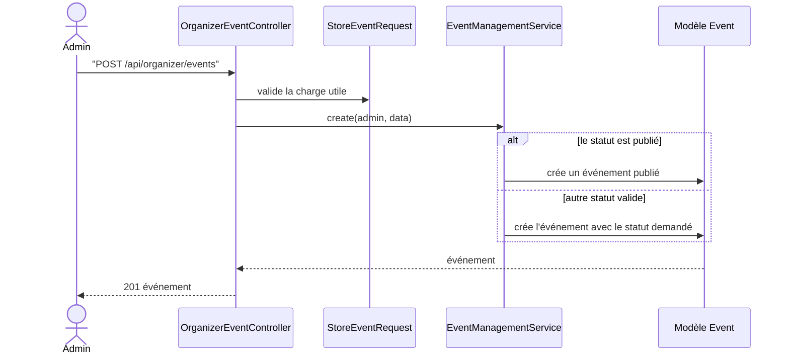

Règles :

- Les administrateurs peuvent créer des événements publiés.
- Les administrateurs peuvent plus tard assigner des organisateurs.

## 9. Flux de Mise à Jour d'un Événement

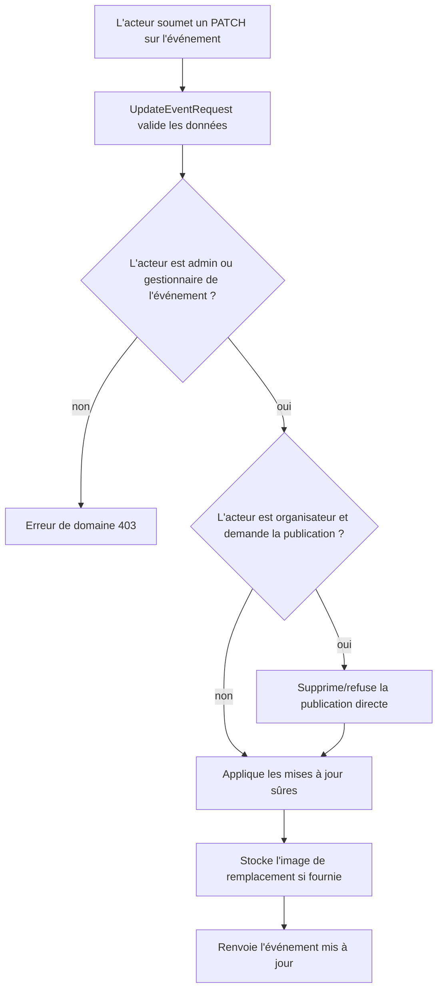

Règles :

- La propriété est vérifiée dans le service.
- La publication par l'organisateur doit passer par une demande de publication et l'approbation d'un administrateur.
- La capacité a son propre flux de travail plus strict.

## 10. Flux de Mise à Jour de la Capacité

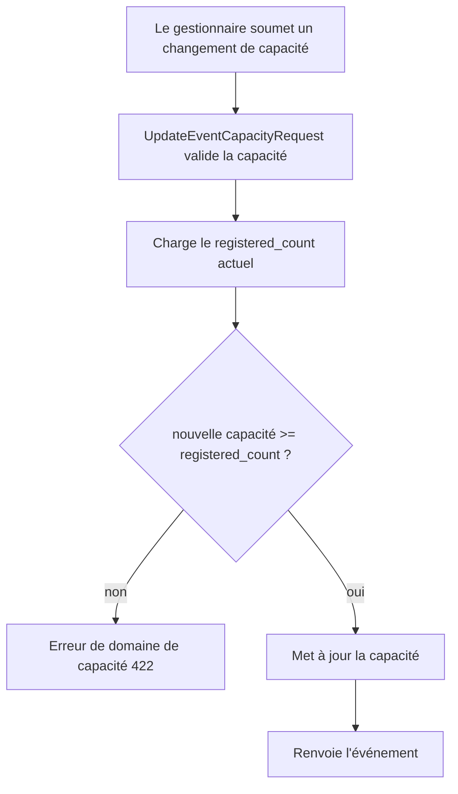

Règles :

- La capacité ne peut jamais être réduite en dessous du nombre de participants inscrits.
- Cela garantit la validité des inscriptions existantes.

## 11. Flux de Demande de Publication

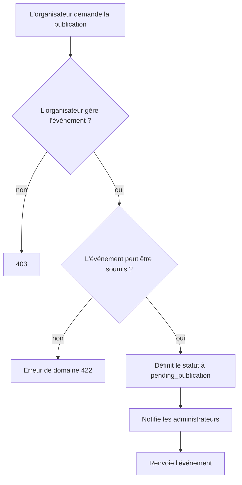

Règles :

- La publication est un flux de travail en deux étapes pour les organisateurs.
- L'approbation d'un administrateur est requise avant que les participants puissent s'inscrire.

## 12. Flux d'Approbation de la Publication

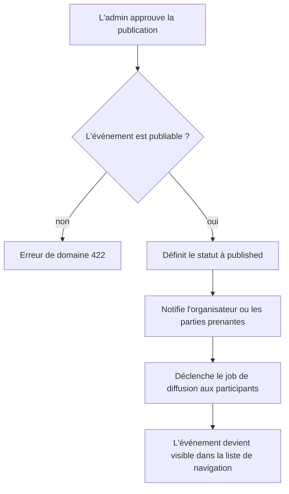

Règles :

- Seuls les administrateurs peuvent approuver la publication.
- Le service accepte uniquement un événement déjà au statut `pending_publication`.
- Les événements publiés deviennent ouverts aux inscriptions si les autres règles d'inscription passent.

## 13. Flux d'Assignation d'un Organisateur par l'Admin

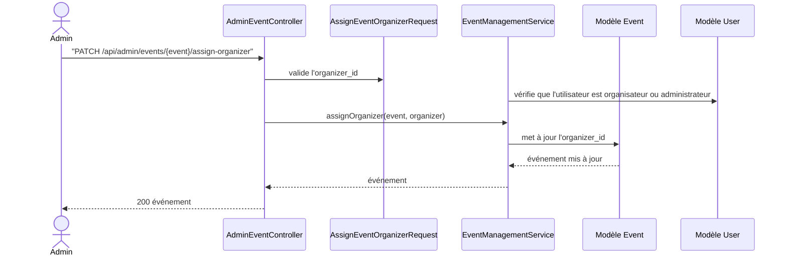

Règles :

- L'utilisateur assigné doit avoir le rôle `organizer` ou `admin`.
- Les administrateurs peuvent toujours gérer tous les événements, même s'ils ne sont pas assignés.

## 14. Flux de Soumission d'une Demande d'Événement par le Client

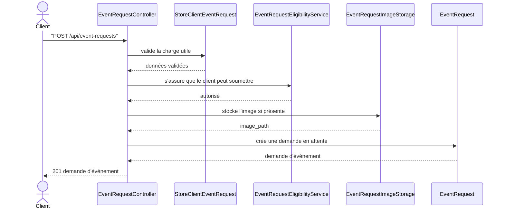

Règles :

- Un client ayant une demande en attente est bloqué pour en soumettre une autre.
- Un client ayant un événement actif est bloqué pour en soumettre une autre.
- Les champs de contact sont par défaut ceux du client authentifié s'ils sont omis.

## 15. Flux de Suppression d'une Demande d'Événement par le Client

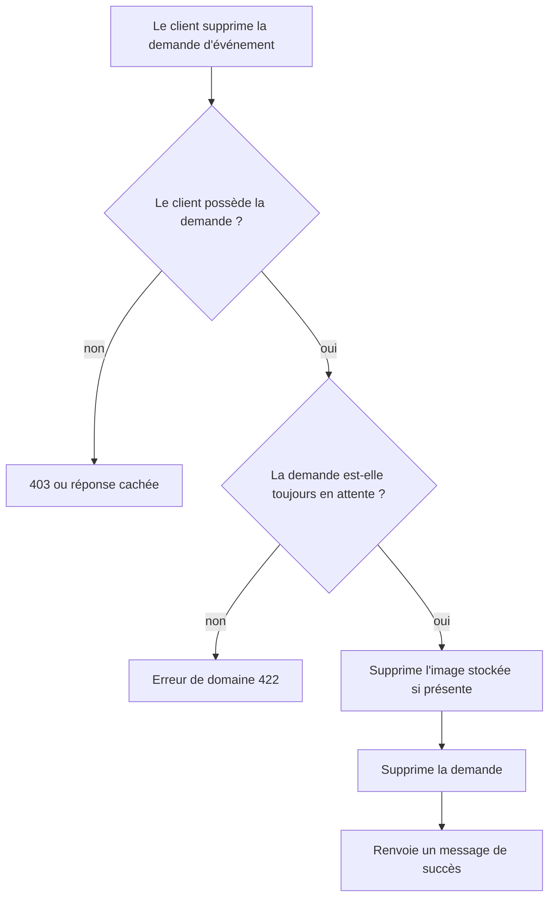

Règles :

- Les demandes révisées constituent un historique d'audit et ne peuvent pas être supprimées par le client.

## 16. Flux d'Approbation d'une Demande d'Événement par l'Admin

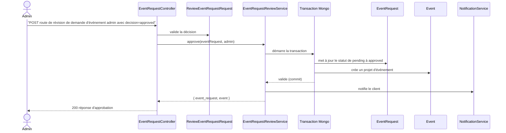

Règles :

- L'approbation est atomique avec la création du projet d'événement.
- La mise à jour du statut est conditionnelle afin qu'une demande déjà révisée ne puisse pas l'être à nouveau.

## 17. Flux de Rejet d'une Demande d'Événement par l'Admin

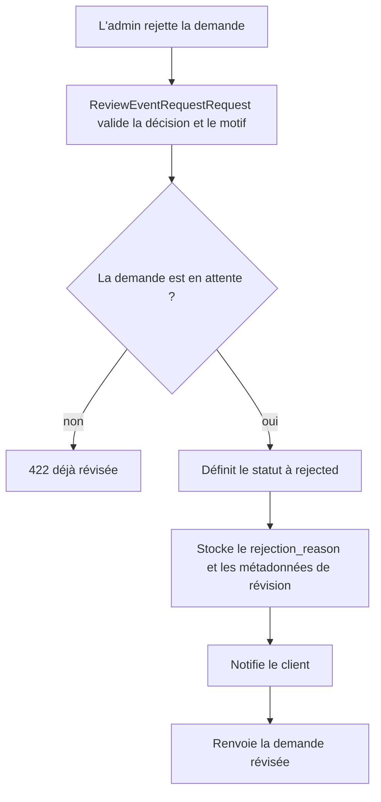

Règles :

- Le rejet nécessite un motif de rejet.
- Aucun événement n'est créé.

## 18. Flux de Tâches d'Événement

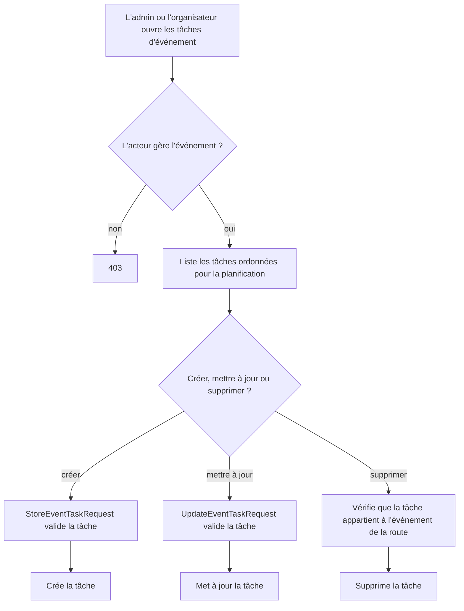

Règles :

- Les tâches sont toujours liées à un événement.
- Une tâche d'un autre événement est rejetée même si l'utilisateur gère les deux événements.

## 19. Flux d'Activités d'Événement

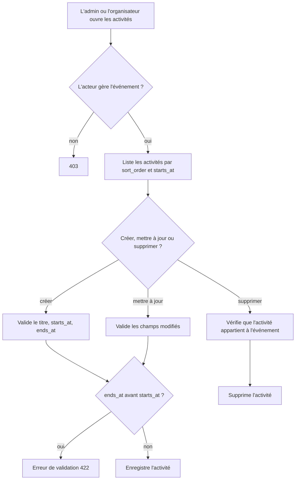

Règles :

- Les activités définissent le programme de l'événement.
- L'heure de fin ne peut pas être antérieure à l'heure de début.

## 20. Flux d'Inscription d'un Participant

```mermaid
sequenceDiagram
    actor P as Participant
    participant API as RegistrationController
    participant Service as ParticipantRegistrationService
    participant Core as RegistrationService
    participant Mongo as Transaction Mongo
    participant Event as Event
    participant Registration as Registration
    participant Payment as Payment
    participant Notify as NotificationService

    P->>API: "POST route d'inscription à l'événement"
    API->>Service: register(participant, event)
    Service->>Core: register(participant, event)
    Core->>Mongo: démarre la transaction
    Mongo->>Event: vérifie la publication et la capacité disponible
    Mongo->>Registration: vérifie l'inscription en double événement/utilisateur
    Mongo->>Event: incrémentation atomique du registered_count
    Mongo->>Registration: crée l'inscription avec un ticket_code unique
    alt événement gratuit
        Mongo->>Payment: crée un paiement gratuit complété
    end
    Mongo-->>Core: valide (commit)
    Core->>Notify: notifie les admins/organisateurs
    Core-->>Service: inscription
    Service-->>API: inscription
    API-->>P: 201 inscription
```

Règles :

- L'événement doit être publié.
- `registered_count` n'augmente que si la capacité est encore disponible.
- `registrations_event_user_unique` empêche les inscriptions en double.
- `registrations_ticket_code_unique` empêche les codes de ticket en double.

## 21. Flux d'Échec d'Inscription pour Capacité Maximale

```mermaid
flowchart TD
    A[Le participant demande une inscription] --> B[Charge l'événement actuel]
    B --> C{registered_count < capacity ?}
    C -- non --> D[Renvoie 422 événement complet]
    C -- oui --> E[Tente une incrémentation atomique où count < capacity]
    E --> F{l'incrémentation a réussi ?}
    F -- non --> D
    F -- oui --> G[Crée l'inscription]
```

Règles :

- La vérification initiale de la capacité ne suffit pas à elle seule.
- La mise à jour conditionnelle est la protection contre les conditions de concurrence (race conditions).

## 22. Flux d'Échec d'Inscription pour Doublon

```mermaid
flowchart TD
    A[Le participant demande une inscription] --> B[Le service vérifie l'inscription existante événement/utilisateur]
    B --> C{Inscription existante trouvée ?}
    C -- oui --> D[Renvoie 422 avec l'inscription existante]
    C -- non --> E[Crée l'inscription]
    E --> F{Conflit d'index unique Mongo ?}
    F -- non --> G[L'inscription réussit]
    F -- oui --> H[Traduit la clé en double en une erreur 422 conviviale]
```

Règles :

- La vérification du service offre une expérience utilisateur propre.
- L'index unique est la protection finale au niveau de la base de données.

## 23. Flux de Paiement

```mermaid
sequenceDiagram
    actor P as Participant
    participant API as RegistrationController
    participant Service as ParticipantRegistrationService
    participant Core as RegistrationService
    participant Mongo as Transaction Mongo
    participant Registration as Registration
    participant Payment as Payment
    participant Notify as NotificationService

    P->>API: "POST route de paiement de l'inscription"
    API->>Service: pay(participant, registration)
    Service->>Core: pay(registration)
    Core->>Mongo: démarre la transaction
    Mongo->>Registration: met à jour de pending à paid
    Mongo->>Payment: crée un paiement card_mock complété
    Mongo-->>Core: valide (commit)
    Core->>Notify: notifie les admins/organisateurs
    Core-->>API: inscription payée
    API-->>P: 200 inscription
```

Règles :

- Les inscriptions déjà payées renvoient une réponse de domaine au lieu de facturer deux fois.
- Les paiements sont stockés en centimes entiers.

## 24. Flux d'Annulation par le Participant

```mermaid
flowchart TD
    A[Le participant supprime l'inscription] --> B{Le participant possède l'inscription ?}
    B -- non --> C[403]
    B -- oui --> D{payment_status est paid ?}
    D -- oui --> E[422 impossible d'annuler une inscription payée]
    D -- non --> F[Supprime l'inscription]
    F --> G[Décrémente le registered_count de l'événement s'il est au-dessus de zéro]
    G --> H[Renvoie un message de succès]
```

Règles :

- Les inscriptions payées ne peuvent pas être annulées via ce point de terminaison.
- L'annulation d'une inscription non payée libère de la capacité.

## 25. Flux de Téléchargement du Ticket

```mermaid
flowchart TD
    A[Le participant demande son ticket] --> B{Possède l'inscription ?}
    B -- non --> C[403]
    B -- oui --> D{Inscription payée ?}
    D -- non --> E[422 ticket non payé]
    D -- oui --> F[Construit la charge utile JSON du ticket]
    F --> G[Diffuse le téléchargement du ticket]
```

Règles :

- Les tickets ne sont disponibles qu'après le paiement.
- L'implémentation actuelle renvoie un fichier de ticket JSON.

## 26. Flux de Gestion des Inscriptions par le Personnel

```mermaid
flowchart TD
    A[L'organisateur ou l'admin ouvre la gestion des inscriptions] --> B{Rôle de l'acteur}
    B -- admin --> C[Peut requêter les inscriptions pour tous les événements]
    B -- organizer --> D[Peut requêter uniquement ses événements gérés]
    C --> E[Filtre event_id optionnel validé comme Mongo ObjectId]
    D --> E
    E --> F[Liste les inscriptions avec les données événement/utilisateur]
    F --> G{Supprimer l'inscription ?}
    G -- oui --> H{Inscription non payée et l'acteur gère l'événement ?}
    H -- non --> I[Erreur de domaine 403 ou 422]
    H -- oui --> J[Supprime l'inscription et décrémente le compteur]
```

Règles :

- Les vues de l'organisateur sont limitées à ses propres événements.
- Les vues de l'administrateur sont globales.
- La suppression par le personnel est toujours bloquée pour les inscriptions payées.

## 27. Flux de Soumission d'un Commentaire

```mermaid
sequenceDiagram
    actor P as Participant
    participant API as FeedbackController
    participant Request as StoreFeedbackRequest
    participant Service as FeedbackService
    participant Registration as Registration
    participant Feedback as Feedback
    participant Notify as NotificationService

    P->>API: "POST route de commentaire d'événement"
    API->>Request: valide la note et le commentaire
    API->>Service: submit(participant, event, data)
    Service->>Registration: vérifie l'inscription payée
    alt aucune inscription payée
        Service-->>API: Erreur de domaine 403
    else éligible
        Service->>Feedback: crée un commentaire en attente
        Service->>Notify: notifie les admins/organisateurs
        Service-->>API: commentaire
        API-->>P: 201 commentaire
    end
```

Règles :

- Seuls les participants ayant payé peuvent soumettre un commentaire.
- Le commentaire commence au statut `pending` (en attente).
- Un index unique empêche les commentaires en double pour le même événement et utilisateur.

## 28. Flux de Modération des Commentaires

```mermaid
flowchart TD
    A[L'admin révise les commentaires en attente] --> B{Approuver ou supprimer ?}
    B -- approuver --> C[Définit le statut à approved]
    C --> D[Notifie l'auteur et le client de l'événement le cas échéant]
    D --> E[Le commentaire devient visible publiquement]
    B -- supprimer --> F[Supprime le commentaire]
    F --> G[Le commentaire est retiré de toutes les listes]
```

Règles :

- Les listes de commentaires publics affichent les commentaires approuvés.
- Les administrateurs peuvent voir les commentaires en attente pour la modération.

## 29. Flux de Statistiques Administrateur

```mermaid
flowchart TD
    A[L'admin appelle /api/admin/stats] --> B{Cache admin_stats_payload disponible ?}
    B -- oui --> C[Renvoie la charge utile cachée]
    B -- non --> D[Compte les utilisateurs par rôle]
    D --> E[Compte les événements et inscriptions]
    E --> F[Compte les demandes et publications en attente]
    F --> G[Somme les centimes de paiement complétés]
    G --> H[Stocke le résultat 60 secondes]
    H --> I[Renvoie la charge utile du tableau de bord]
    J["Mutation User/Event/EventRequest/Registration/Payment/Feedback"] --> K["AdminStatsCacheObserver oublie le cache"]
```

Règles :

- Le revenu utilise uniquement les paiements complétés.
- Les montants sont sommés à partir des centimes, et non des champs d'affichage décimaux.
- Les statistiques administrateur utilisent un cache court pour éviter de recalculer plusieurs agrégations à chaque hit, et ce cache est invalidé sur les modèles qui alimentent le tableau de bord.

## 30. Flux de Statistiques Client

```mermaid
flowchart TD
    A[Le client appelle /api/client/stats] --> B[Trouve les demandes d'événement du client]
    B --> C[Trouve les événements créés à partir des demandes approuvées]
    C --> D[Groupe les demandes par statut]
    D --> E[Somme des revenus pour les événements possédés/demandés]
    E --> F[Renvoie la charge utile du tableau de bord client]
```

Règles :

- Les statistiques client sont limitées aux demandes/événements de ce client.
- Le revenu du client est dérivé des paiements complétés sur ses événements.

## 31. Flux d'Administration des Utilisateurs

```mermaid
sequenceDiagram
    actor Admin
    participant API as UserAdminController
    participant Request as "FormRequest Utilisateur"
    participant Service as UserWriteService
    participant User as Modèle User

    Admin->>API: "GET/POST/PATCH/DELETE /api/admin/users"
    API->>Request: valide le rôle, l'email, le mot de passe, les filtres
    API->>Service: crée/met à jour/supprime l'utilisateur
    alt auto-suppression demandée
        Service-->>API: 422 auto-suppression bloquée
    else opération valide
        Service->>User: enregistre le changement
        User-->>Service: utilisateur ou résultat de suppression
        Service-->>API: résultat
        API-->>Admin: réponse JSON
    end
```

Règles :

- Les administrateurs gèrent les utilisateurs.
- L'auto-suppression est bloquée.
- L'unicité de l'email est appliquée par la validation et l'index Mongo.

## 32. Flux de Vérification de Santé (Health Check)

```mermaid
flowchart TD
    A["GET /api/health"] --> B[Vérifie la connexion MongoDB]
    B --> C[Vérifie la connexion Redis]
    C --> D{Toutes les dépendances sont OK ?}
    D -- oui --> E[Statut 200 OK]
    D -- non --> F[Statut 503 Dégradé]
    E --> G[Renvoie le rapport d'état des services]
    F --> G
```

Règles :

- Les vérifications de santé sont publiques.
- Le point de terminaison est utilisé par les healthchecks Docker et les tests de fumée locaux.
- En production (`APP_DEBUG=false`), les erreurs de dépendances sont génériques pour ne pas exposer de détails MongoDB ou Redis.

## 33. Flux des Middlewares API Transversaux

```mermaid
flowchart TD
    A["La requête API entre dans Laravel"] --> B[Middleware AttachRequestId]
    B --> C[Middleware de rôle/auth si la route l'exige]
    C --> D[Contrôleur ou FormRequest]
    D --> E[Réponse générée]
    E --> F[Middleware ApplyApiSecurityHeaders]
    F --> G[Réponse JSON avec ID de requête et en-têtes de sécurité, dont CSP]
```

Règles :

- Les erreurs d'API renvoient du JSON.
- Un `X-Request-Id` entrant sûr est réutilisé ; sinon, un nouvel ID de requête est généré.
- Des en-têtes de sécurité sont attachés aux réponses de succès et d'erreur, y compris `Content-Security-Policy`.

## 34. Résumé de la Propriété des Flux de Travail

| Flux de Travail | Acteur Principal | Service Principal | Collections Principales |
| --- | --- | --- | --- |
| Créer un compte | visiteur | `UserWriteService` | `users`, `personal_access_tokens` |
| Connexion/déconnexion | tout utilisateur | Auth Laravel/Sanctum | `users`, `personal_access_tokens` |
| Parcourir les événements | utilisateur authentifié | `EventListingService` | `events` |
| Créer/maj événement | admin, organisateur | `EventManagementService` | `events`, `users` |
| Demander publication | organisateur | `EventManagementService` | `events`, `app_notifications` |
| Approuver publication | admin | `EventManagementService`, `FanOutPublishedEventNotifications` | `events`, `app_notifications`, `users` |
| Soumettre demande événement | client | `EventRequestSubmissionService` | `event_requests`, `events` |
| Réviser demande événement | admin | `EventRequestReviewService` | `event_requests`, `events` |
| Gérer les tâches | admin, organisateur | `EventTaskService` | `event_tasks`, `events` |
| Gérer les activités | admin, organisateur | `EventActivityService` | `event_activities`, `events` |
| S'inscrire à un événement | participant | `RegistrationService` | `events`, `registrations`, `payments` |
| Payer l'inscription | participant | `RegistrationService` | `registrations`, `payments` |
| Annuler l'inscription | participant | `RegistrationService` | `registrations`, `events` |
| Staff gère inscriptions | admin, organisateur | `StaffRegistrationService` | `registrations`, `events` |
| Soumettre commentaire | participant | `FeedbackService` | `feedbacks`, `registrations`, `events` |
| Modérer commentaires | admin | `FeedbackService` | `feedbacks`, `app_notifications` |
| Notifications | tous les utilisateurs authentifiés | `NotificationService`, `NotificationInboxService`, `FanOutPublishedEventNotifications` | `app_notifications`, `users` |
| Stats | admin, client | `AdminStatsService` avec cache 60 s invalidé par observer, `ClientStatsService` | `users`, `events`, `event_requests`, `registrations`, `payments`, `feedbacks` |
